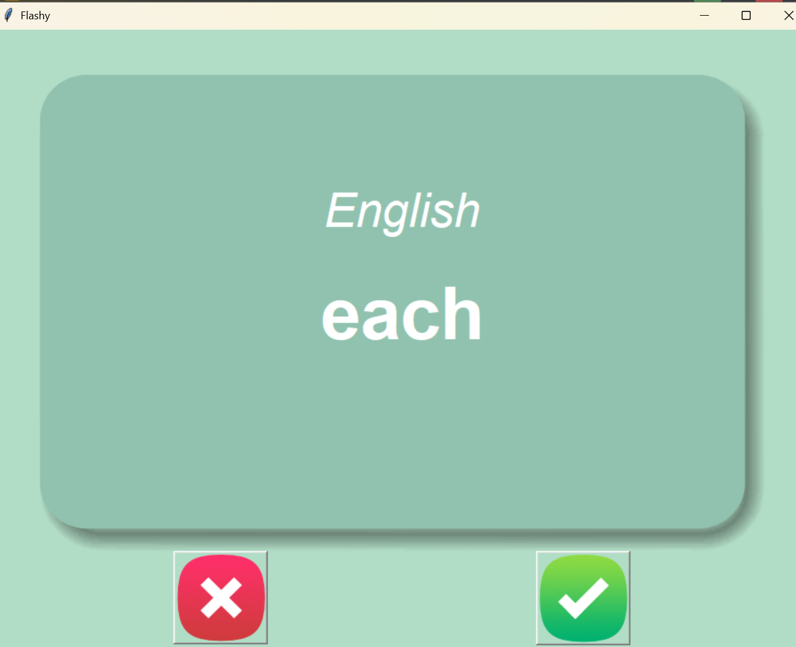

# 🧠 Flashy - French Vocabulary Learning App

## 📌 Overview

**Flashy** is a GUI-based flashcard app that helps users learn French vocabulary interactively. Built with **Python**, **Tkinter**, and **pandas**, the app dynamically presents French words and their English meanings, tracks learning progress, and adapts by filtering out known words.

---

## 🚀 Features

* 📚 **Flashcard-based Learning**: Presents one French word at a time and flips to show the English translation.
* 🕒 **Timed Flip**: Automatically flips the card after 3 seconds.
* ✅ **Adaptive Learning**: Marks known words and removes them from the learning pool.
* 📂 **Progress Tracking**: Saves remaining words to `words_to_learn.csv` for continued practice.
* 🖼️ **Custom GUI**: Uses images for cards and buttons for an intuitive user interface.

---

## 🛠️ Tech Stack

* **Python 3.x**
* **Tkinter** – for GUI development
* **pandas** – for reading/writing CSV files
* **random** – to randomly display flashcards

---

## 📁 Project Structure

```
project/
├── main.py                     # Main application logic
├── data/
│   ├── french_words.csv        # Initial set of French-English words
│   └── words_to_learn.csv      # User progress (auto-generated)
└── images/
    ├── card_front.png          # Front of the flashcard
    ├── card_back.png           # Back of the flashcard
    ├── right.png               # 'Known' button image
    └── wrong.png               # 'Unknown' button image
```

---

## 🔄 How It Works

1. On launch, it loads `words_to_learn.csv` if available; otherwise, it uses the original word list.
2. Shows a French word and auto-flips to its English translation after 3 seconds.
3. Clicking the ✔️ button marks the word as "known" and removes it from the list.
4. Clicking the ❌ button skips the word without marking it.
5. Progress is saved automatically after every known word.

---

## 🧪 Ideal Use Case

Perfect for students or professionals preparing for French exams, or anyone aiming to expand their French vocabulary through spaced repetition and interactive learning.

---

## 📱 Sample Output

The app window displays a flashcard with:



* Language on top (e.g., "English")
* Word to learn in large text (e.g., "each")
* Red ❌ and green ✔️ buttons below for user interaction a flashcard with:
* Language on top (e.g., "English")
* Word to learn in large text (e.g., "each")
* Red ❌ and green ✔️ buttons below for user interaction

---

## 📬 Learning Outcomes

This project demonstrates the ability to:

* Build user-friendly GUI apps with state management
* Work with file I/O and persistence using pandas
* Implement core UX logic like timers, event handling, and dynamic updates
* Design scalable and reusable Python code for real-world applications
