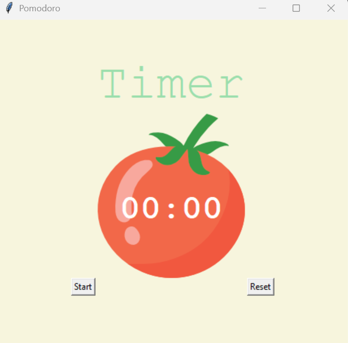

# 📅 Pomodoro Timer - Productivity App

## 📍 Overview

The **Pomodoro Timer** is a desktop productivity tool that follows the Pomodoro Technique to improve focus and time management. Built with **Python** and **Tkinter**, it provides a responsive GUI with clear session tracking and automated cycle switching. It is perfect for developers, students, and professionals who follow focused time-boxed sessions interleaved with short breaks for mental refreshment.

---

## ✨ Features

* ⏱️ **25-Min Work Cycles** (or 1-min for demo)
* 📆 **Short (5 min) and Long (20 min) Breaks**
* ⏲️ **Auto Countdown and Restart Logic**
* ❌ **Reset Timer** at any point
* ✅ **Progress Tracking with Check Marks**

---

## 📁 Structure

```
project/
├── main.py         # Application logic
└── tomato.png      # Image asset used in GUI
```

---

## 🚀 How It Works

1. Click **Start** to begin a 25-minute (or 1-minute demo) focus session.
2. Timer automatically switches to a **5-minute break** after the session.
3. Every 4 sessions, a **20-minute long break** is triggered.
4. Progress is visualized with check marks after each work cycle.
5. Click **Reset** to stop and clear the timer at any point.
6. Session logic uses an internal repetition counter (`reps`) and `after()` callbacks for real-time countdowns.

---

## 📱 Sample Output



The Pomodoro Timer app displays:

* A bold "Timer" label at the top
* A tomato graphic with a countdown clock at the center
* Start and Reset buttons beneath the timer for user interaction

---

## 📬 Learning Outcomes

This project demonstrates the ability to:

* Design productivity tools based on time management methods
* Build GUI apps using Tkinter and canvas drawing
* Handle timed events and stateful workflows
* Apply structured logic with Python functions and Tkinter callbacks
* Create clean and responsive desktop UIs with real-time interaction
