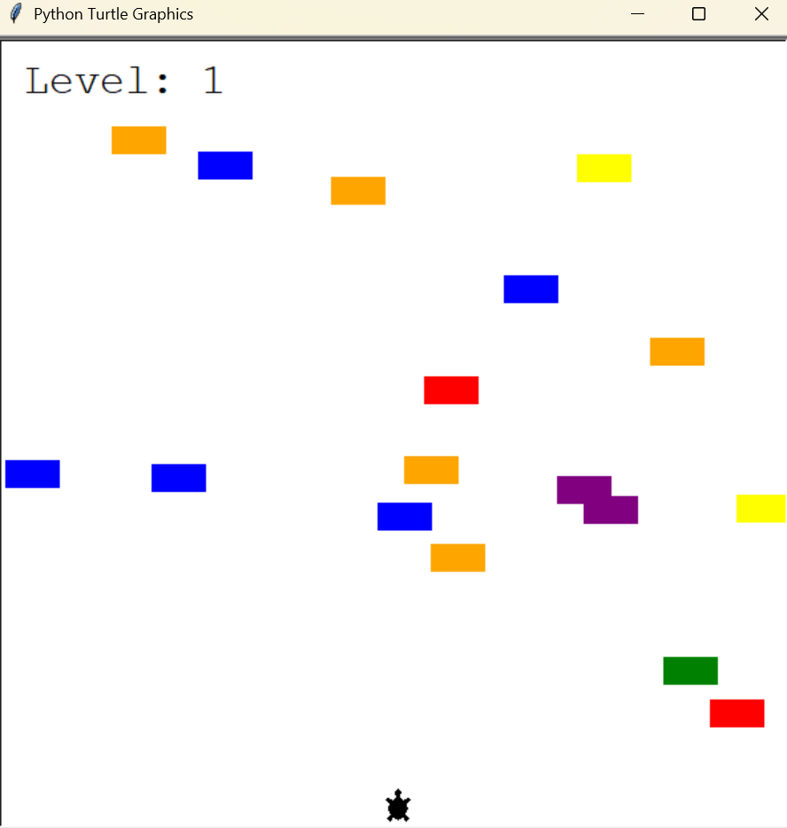

# 🚗 Turtle Crossing Game - Python Arcade Clone

## 📍 Overview

This is a **Turtle Graphics-based arcade-style game** where the player controls a turtle trying to cross a busy road while avoiding oncoming cars. The game increases in difficulty as the player successfully crosses the screen.

---

## ✨ Features

* 🚗 **Random Car Generation** across the screen
* ⬆️ **Keyboard Controls** to move the turtle upward
* ⚡ **Speed Increases** with each successful level
* 🎉 **Scoreboard with Level Display**
* ❌ **Collision Detection** with game over message

---

## 🛠️ Tech Stack

* **Python 3.x**
* **turtle** module for GUI graphics
* **OOP** for game logic encapsulation

---

## 📁 Project Structure

```
project/
├── main.py           # Game loop and screen setup
├── player.py         # Player turtle logic
├── car_manager.py    # Car creation and movement logic
└── scoreboard.py     # Display level and game over messages
```

---

## 🚀 How It Works

1. The turtle starts at the bottom of the screen.
2. Cars are randomly created and move from right to left.
3. The player uses the Up arrow key to move the turtle forward.
4. On reaching the top, the turtle resets and the level increases (cars speed up).
5. If the turtle collides with a car, the game ends with a "GAME OVER" message.

---

## 📱 Sample Output

```
Level: 1
[Player turtle moves upward]
[Cars move from right to left]
[Player reaches finish line]
Level: 2
...
[Collision detected]
GAME OVER
```

---

## 📬 Learning Outcomes

This project demonstrates the  skills in:

* Object-Oriented Programming with Python
* GUI and animation logic using the turtle module
* Event-driven programming with keyboard inputs
* Game design patterns: entity movement, collision detection, level-up logic

It showcases interactive programming and modular design ideal for entry-level game dev or Python GUI roles.
